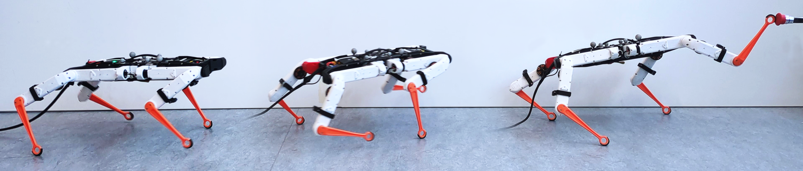

# Latent Conditioned Loco-Manipulation using Motion Priors

[Website](https://gepetto.github.io/LaCoLoco/) 



The official implementation of *Latent Conditioned Loco-Manipulation using Motion Priors* by Maciej Stępień, Rafael Kourdis, Constant Roux and Olivier Stasse (accepted for the 2025 IEEE-RAS 24th International Conference on Humanoid Robots (Humanoids)).


## Installation


First install the [Isaac Lab version v1.4.1 with rlgames v1.6.1](https://isaac-sim.github.io/IsaacLab/v1.4.1/source/setup/installation/pip_installation.html). Then, in the main directory of this repository, run:

```
pip install -e exts/ase_envs
```

## Usage

Training has two stages: **low-level controller (LLC)** - a latent conditioned motion policy that can be reused, and **high-level controller (HLC)** - a point reaching task that demonstrates locomotion and manipulation capabilities of the motion policy.

Below you can find an example for training Solo synthetic motions with ASE DRAIL (scripts with more examples of training and running can be found in the `utils` directory):

```
EXPERIMENT_ID=pedipulation_0

python ase/run.py --task Solo-ASE-DRAIL --motion_file ase/data/motions/solo/dataset.yaml --headless --experiment_name="solo_ase_drail" --experiment_id="$EXPERIMENT_ID"

python ase/run.py --task Solo-Pedipulation-HRL-ASE-DRAIL --motion_file ase/data/motions/solo/dataset.yaml --headless --llc_checkpoint="logs/rl_games/solo_ase_drail/solo_ase_drail_$EXPERIMENT_ID/nn/solo_ase_drail.pth" --experiment_name="solo_hrl_ase_drail" --experiment_id="$EXPERIMENT_ID"
```

In general, a basic template for training LLC looks like this:
```
python ase/run.py --task {ROBOT_NAME}-{METHOD_NAME} --motion_file {DATASET_NAME}
```

**ROBOT_NAME**:
* `Solo`
* `H1`

**METHOD_NAME**:
* `ASE`
* `ASE-CaT`
* `ASE-DRAIL`
* `ASE-DRAIL-CaT`

**DATASET_NAME**:
* `ase/data/motions/solo/dataset.yaml` (Solo synthetic)
* `ase/data/motions/solo_mocap/dataset_valid.yaml` (Solo retargetted from dog motions)
* `ase/data/motions/h1/dataset.yaml` (H1 synthetic)


Template for training HLC: 
```
python ase/run.py --task {TASK_NAME}-HRL-{METHOD_NAME} --motion_file {DATASET_NAME} --llc_checkpoint={PATH_TO_LLC_CHECKPOINT}
```

**TASK_NAME**:
* `Solo-Pedipulation`
* `H1-Manipulation`

## Acknowledgement

This work was based on [ASE](https://github.com/nv-tlabs/ASE), [DRAIL](https://github.com/NVlabs/DRAIL), [CaT](https://github.com/Gepetto/constraints-as-terminations) and [IsaacLab](https://github.com/isaac-sim/IsaacLab).


## Citation

```
@inproceedings{mstepien2025lacoloco,
      title={Latent Conditioned Loco-Manipulation using Motion Priors},
      author={Maciej Stępień and Rafael Kourdis and Constant Roux and Olivier Stasse},
      booktitle={IEEE-RAS 24th International Conference on Humanoid Robots (Humanoids)},
      year={2025}
}
```